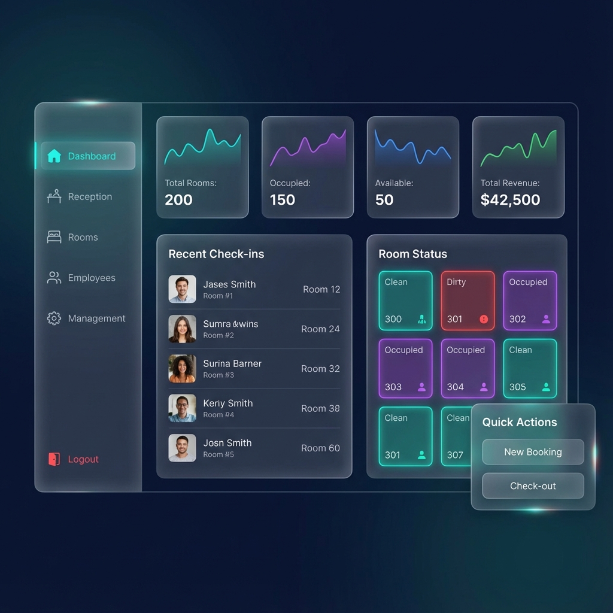
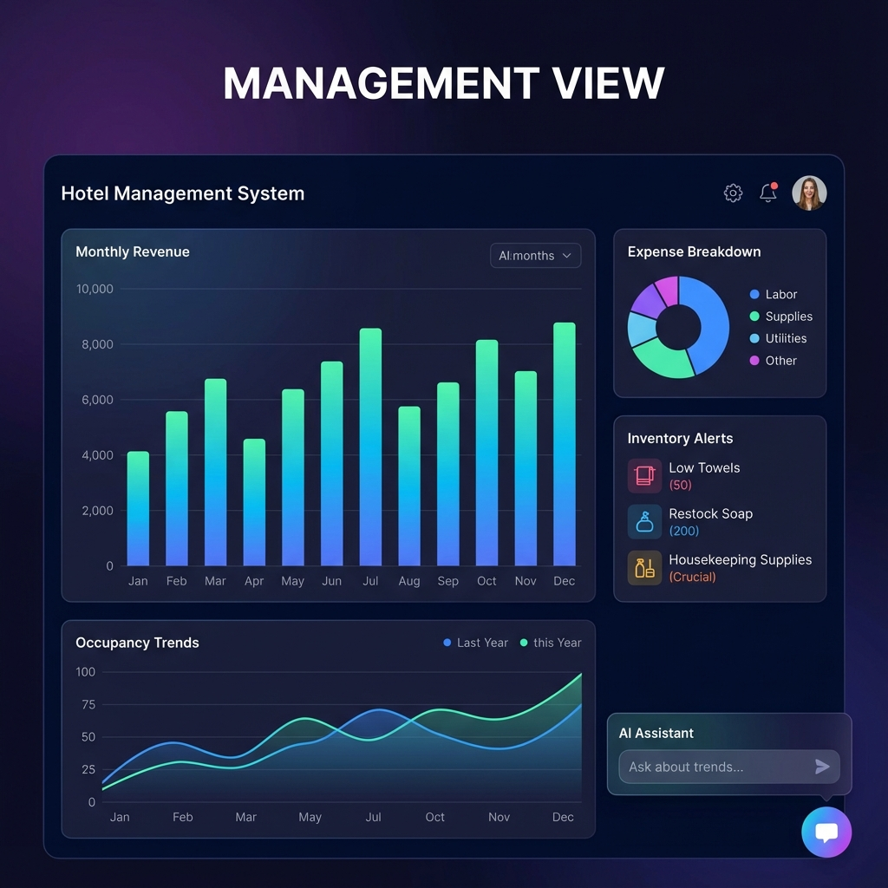
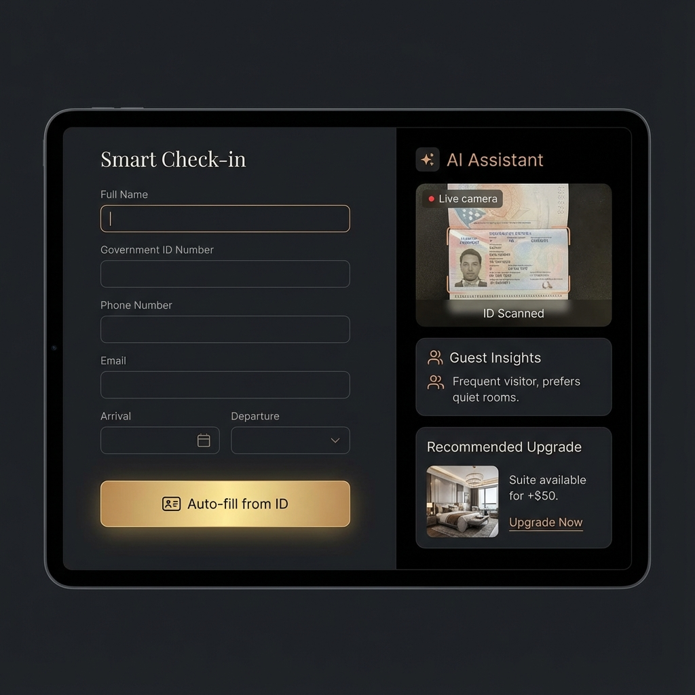
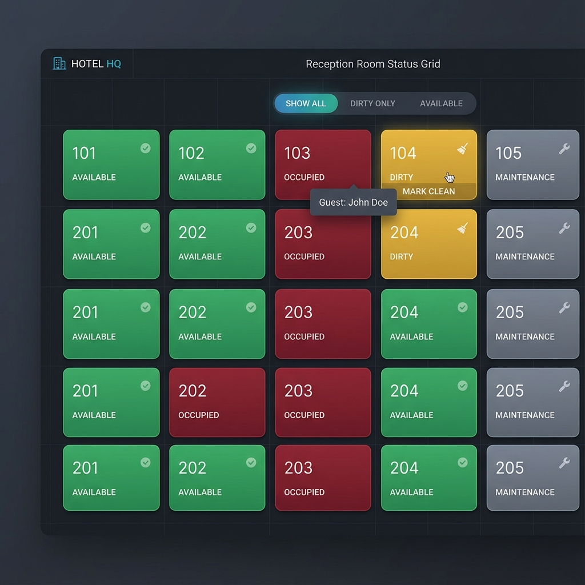
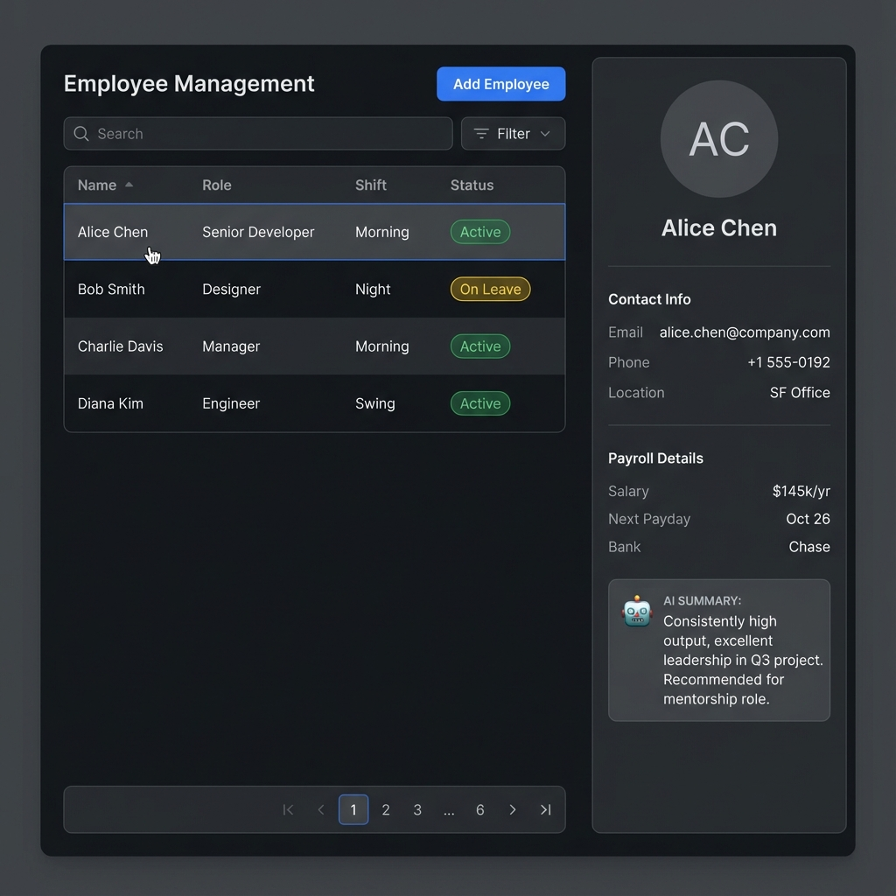
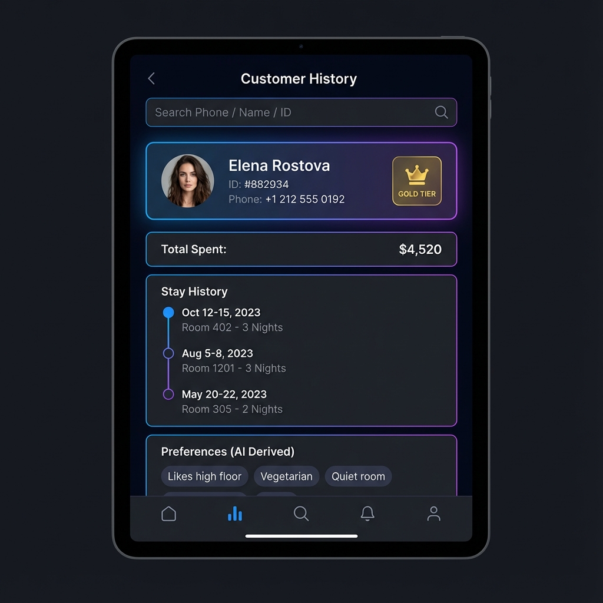

# Hotel Management System Modernization Requirements

## 1. Overview
Modernize the legacy Java Swing application to a robust, cross-platform desktop application using modern web technologies. The system will serve a decade-old hotel chain, ensuring continuity of existing operations while introducing AI-driven efficiency and mobile accessibility.

## 2. Functional Requirements

### 2.1 Core Functionality (Legacy Parity)
The new system must replicate all existing features:
- **Authentication**: Login/Logout for Admin and Staff.
- **Dashboard**: Quick view of hotel status.
- **Reception**:
  - New Customer Form (Check-in).
  - **Room Status Grid**: Visual representation of all rooms (Clean/Dirty/Occupied).
  - **Housekeeping Workflow**: Mark rooms as "Dirty" on checkout. Notify staff. Reception can mark "Clean" when ready.
  - Employee Info & Management.
  - Customer Info & History.
  - Manager Info.
  - Check-out (Billing, Room Release triggers "Dirty" status).
  - Update Check Status & Room Status.
- **Administration**:
  - Add Employee.
  - Add Room.
  - Add Driver.

### 2.2 New Features
- **Management View**:
  - Visual analytics (Bar/Line/Pie charts).
  - Expense tracking.
  - Inventory monitoring.
  - Occupancy trends.
- **LLM Integration**:
  - **Smart Check-in/Out**: Auto-fill forms via ID scan (OCR) or voice dictation.
  - **Customer Insights**: Analyze booking history to suggest room preferences or services.
  - **Staff Assistant**: Natural language queries for inventory ("Do we have enough towels?") and operational guidelines.
- **Mobile Booking**:
  - Mobile-optimized web interface (PWA) for guests to book directly.
  - Zero/Low-cost distribution (no app store needed).

## 3. Non-Functional Requirements
- **Cross-Platform**: Must run on macOS, Windows, and Linux (Desktop & Kiosk).
- **Security**: Secure authentication, encrypted data storage, role-based access control.
- **Cost-Efficiency**: Minimal recurring costs for DB and hosting.
- **Performance**: Fast load times, offline-first capability for core desktop functions.

## 4. Technical Architecture Recommendations

### 4.1 Tech Stack
- **Framework**: **Electron** + **React** + **TypeScript**.
  - *Why*: Electron allows building a single installable file (`.exe`, `.dmg`) that contains both the frontend and the backend logic.
  - *Language Consolidation*: Using **TypeScript** for both frontend (React) and backend (Node.js inside Electron) significantly simplifies packaging. You do **not** need a separate Python installation.
  - *Packaging*: Electron Forge or Electron Builder can package the entire app into a professional installer.

### 4.2 Database
- **Recommendation**: **SQLite** (Local).
  - *Why*: It is a single file, requires zero hosting costs, and is extremely fast. Perfect for a desktop app.
  - *Multi-user*: If multiple receptionists need to access data simultaneously, we can use a shared local network folder for the SQLite file OR use **Supabase** (PostgreSQL) free tier for cloud sync.

### 4.3 LLM Integration & Costs
- **Model**: **Google Gemini Flash 1.5**.
  - *Cost*: **Free tier available** (up to 15 RPM). Paid tier is extremely cheap ($0.35 / 1M tokens).
  - *Integration*: The Node.js backend in Electron will call the Gemini API.
  - *Capabilities*:
    - **RAG (Retrieval Augmented Generation)**: The app sends a guest's history (JSON) to Gemini and asks "Summarize preferences".
    - **Sentiment Analysis**: Analyze guest feedback/emails.
    - **Multi-lingual Support**: Real-time translation for foreign guests.
    - **Drafting**: Auto-draft confirmation emails or invoices.

### 4.4 Mobile Booking Strategy (PWA)
- **Hosting**: **Firebase Hosting** or **Vercel**.
  - *Cost*: **Free** (Spark plan on Firebase is free forever for generous limits).
  - *Architecture*: A simple React PWA.
  - *Sync*: PWA writes to a cloud DB (like Firebase Firestore or Supabase). The Desktop App syncs with this cloud DB to get new bookings.

## 5. UI/UX Design
- **Theme**: Modern, clean, professional. Dark/Light mode support.
- **Navigation**: Sidebar navigation instead of multiple popup windows.
- **Visuals**: Glassmorphism effects, smooth transitions, clear data visualization.

## 6. UI Mockups

### 6.1 Modern Dashboard

### 6.2 Management Analytics View

### 6.3 Smart Check-in (LLM Integrated)

### 6.4 Reception Room Status Grid

### 6.5 Employee Management

### 6.6 Customer History

